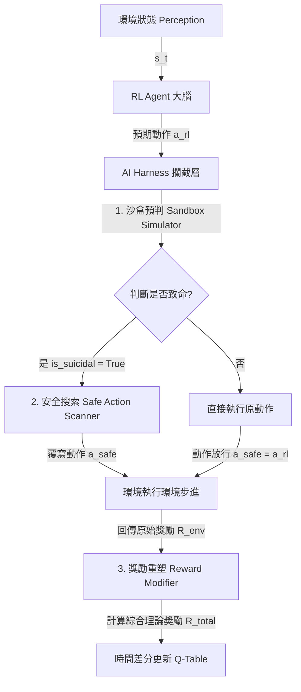
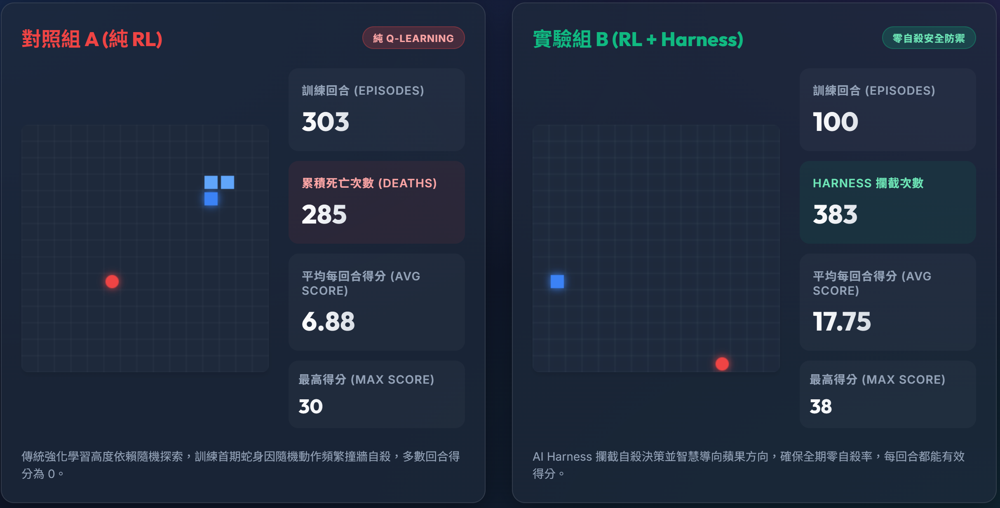
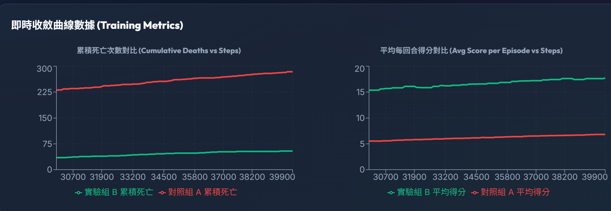

# 基於 AI Harness 系統之強化學習貪食蛇安全駕馭架構研究

## 1. 問題定義與應用背景 (Problem Definition & Background)

在傳統的強化學習（Reinforcement Learning, RL）中，Agent 必須透過不斷嘗試與錯誤（Trial and Error）來學習環境的互動策略。然而，當我們試圖將 RL 模型部署至真實世界的安全關鍵領域（Safety-Critical Applications，如自動駕駛、工業機械手臂、無人機控制）時，會面臨以下痛點：
1. **初期高死亡率與硬體損耗**：模型在訓練初期因隨機探索，極易做出致命動作（如撞牆、超速），在真實世界中這意味著災難性的損壞與高昂的成本。
2. **無效探索導致收斂緩慢**：頻繁的失敗會導致訓練回合（Episode）過早終止，Agent 無法獲得足夠的長序列經驗來學習如何獲得正向獎勵，導致收斂速度極其緩慢。

本專案以經典的**貪食蛇遊戲（Snake Game）**為驗證載體，提出並實作了 **AI Harness（安全駕馭系統）** 架構，旨在解決上述痛點，達成在「零死亡風險」的前提下無痛加速模型收斂。

---

## 2. AI Harness 系統設計 (AI Harness System Design)

**AI-Harness (安全駕馭系統)** 是一種介於強化學習代理（Agent）與環境（Environment）之間的中介防禦層（Middleware）。其設計理念來自於自駕車或工業控制中的「安全沙盒機制」。
其核心哲學為 **「不修改大腦模型，只限制行為邊界」**，整體動作轉換機制定義如下：

$$f(s_t, a_{rl}) = (a_{safe}, R_{penalty})$$

AI-Harness 的三大核心防禦機制包含：
1. **攔截與沙盒模擬 (Intercept & Simulate)**：當 Agent 根據當下狀態輸出預期動作時，Harness 會在內部「虛擬沙盒」中預判該動作的後果。若會導致撞牆或自咬等致命狀態，則判定該動作為「不安全」。
2. **強行覆寫與安全兜底 (Action Override & Fallback)**：若動作被判定不安全，Harness 會沒收控制權，並透過安全搜索在剩餘方向中尋找「安全方向」覆寫原動作，確保 Agent 不會死亡。
3. **獎勵重塑 (Reward Shaping & Guidance Signal)**：為了讓 Agent 知道原本的決策是錯的，Harness 介入時會發送負面的虛擬懲罰值（如 $R=-5$）給大腦，使模型能持續修正錯誤觀念。

---

## 3. Tools 設計 (Tools Design)

本系統的實作中，設計了三個核心的工具模組來支撐 AI-Harness 的運作：

1. **`SandboxSimulator` (沙盒預判器)**
   * **功能**：在不改變真實環境狀態的前提下，拷貝當前的遊戲狀態（蛇身座標、環境邊界），並模擬 Agent 的預期動作。
   * **作用**：提供一個無風險的測試場域，回傳該動作是否會觸發 `is_suicidal` (致命) 標記。
2. **`SafeActionScanner` (安全動作掃描器)**
   * **功能**：當原動作被判定為致命時被觸發。它會依序評估剩餘的 3 個可能方向，檢查哪一個方向可以讓蛇存活。
   * **作用**：提供安全兜底，確保無論 Agent 原本的決策多麼愚蠢，最終送入環境的動作必定是當下相對安全的。
3. **`RewardModifier` (獎勵重塑器)**
   * **功能**：攔截環境原本的回饋信號，並根據 Harness 是否介入來動態調整獎勵。
   * **作用**：若 Harness 觸發了覆寫，則強制發出強烈的負向懲罰信號（Penalty）取代環境的存活獎勵，引導 Q-Table 朝正確方向更新。

---

## 4. Workflow / Agent 流程說明 (Workflow & Agent Process)

在每一個遊戲影格（Step）中，Agent 與 Harness 系統的互動 Workflow 如下圖所示：

**執行流程解析**：
1. **狀態感知**：RL Agent 獲取當前環境狀態（蘋果相對位置、障礙物相對位置）。
2. **決策產出**：Agent 根據 Q-Table 輸出動作 $a_{rl}$。
3. **Harness 介入**：進入 SandboxSimulator 檢查。
4. **安全分支**：若安全，放行 $a_{rl}$；若危險，呼叫 SafeActionScanner 覆寫為 $a_{safe}$。
5. **環境執行**：將安全的動作送入遊戲環境執行。
6. **經驗更新**：透過 RewardModifier 修正獎勵，將狀態、動作、修正後獎勵存入經驗池並更新 Q-Table。

---

## 5. Evaluation 方法 (Evaluation Method)

為了驗證 AI Harness 的有效性，我們設計了嚴格的 A/B 測試評估方法。在相同的硬體資源與超參數下，同時運行兩組模型進行對比：
* **對照組 A (Baseline)**：純 Q-Learning 模型，直接與環境互動。
* **實驗組 B (Proposed)**：加裝 AI Harness 系統的 Q-Learning 模型。

### 評估指標 (Metrics)
1. **累積死亡次數 (Cumulative Deaths)**：評估系統是否能提供絕對的硬體安全保障（理想目標為 0）。
2. **平均每回合得分 (Average Score)**：評估模型學習「獲取正向獎勵（吃蘋果）」的效率。
3. **Harness 攔截次數 (Intervention Count)**：觀察 Agent 隨時間推移，依賴安全機制的頻率是否下降（代表 Agent 逐漸學會自主安全避障）。

### 系統運行結果與圖表比較

#### 儀表板綜合比較 (Dashboard)

* **對照組 A**：累積死亡高達 285 次，平均得分僅 6.88 分。
* **實驗組 B**：Harness 成功攔截了 383 次致命動作，維持 **0 死亡** 完美紀錄，平均得分高達 17.75 分。

#### 訓練指標即時收斂曲線 (Training Metrics)

* **左圖 (累積死亡對比)**：對照組 A 呈線性上升；實驗組 B 完美貼近 0 軸。
* **右圖 (平均得分對比)**：實驗組 B 從初期即維持高水準並穩定攀升，證明了「活得久才能學得快」的強化學習防護優勢。
