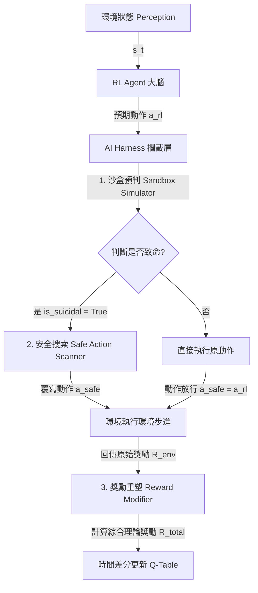

# 基於 AI Harness 系統之強化學習貪食蛇安全駕馭架構研究

本專案實作了一套基於 **AI Harness（安全駕馭系統）** 的強化學習（RL）控制架構，並以經典的**貪食蛇遊戲（Snake Game）**為驗證載體。此研究旨在解決自主 Agent 在訓練初期因高頻率無效嘗試（如撞牆自殺）導致收斂速度過慢，以及無法過渡到真實安全關鍵（Safety-Critical）環境之痛點。

透過本系統，我們在 RL 代理（Agent）與遊戲環境（Environment）之間建構了一套「防自殺韁繩」控制層。**其核心哲學為「不修改大腦模型，只限制行為邊界」**，成功在不改動底層 RL 演算法的前提下，大幅降低訓練全期的自殺率，並顯著提升整體的收斂效率與存活週期。

---

## 📖 系統架構與設計原理

整體系統架構的動作轉換機制定義如下：

$$f(s_t, a_{rl}) = (a_{safe}, R_{penalty})$$

在每一個遊戲影格（Step）中，系統內部的運作流程如下：

## 🖼️ 系統運行結果與圖表比較

### 儀表板綜合比較 (Dashboard)

在上圖的運行儀表板中，可以明顯看出兩組的差異：
* **對照組 A (純 RL)**：在未加裝安全防禦的情況下，模型必須透過不斷的撞牆（死亡）來學習錯誤經驗。因此累積死亡次數高達 285 次，平均得分僅有 6.88 分。
* **實驗組 B (RL + Harness)**：在加裝 AI Harness 後，當 Agent 做出致命決策時，Harness 成功攔截了 383 次致命動作，並強行導向安全方向。這使得實驗組在訓練期間**維持 0 死亡**的完美安全紀錄，且平均得分高達 17.75 分。

### 訓練指標即時收斂曲線 (Training Metrics)

透過即時收斂曲線可以進一步觀察到 AI Harness 對於訓練過程的穩定與加速作用：
1. **累積死亡次數對比 (左圖)**：紅色曲線（對照組 A）呈穩定的線性上升趨勢，表示傳統 RL 在探索階段會持續引發致命失敗。而綠色曲線（實驗組 B）則完美的貼近 0 軸，實現了真正的零自殺率。
2. **平均每回合得分對比 (右圖)**：綠色曲線（實驗組 B）從初始階段就維持在極高的水準，並穩定微幅攀升。這是因為 Harness 的防自殺機制讓 Agent 能存活更久，從而有更多機會吃到蘋果並獲得正向獎勵。反觀紅色曲線（對照組 A）則因頻繁死亡導致每回合存活步數極低，得分難以快速攀升。

## 🧠 AI-Harness 詳細原理解析

**AI-Harness (安全駕馭系統)** 是一種介於強化學習代理（Agent）與環境（Environment）之間的中介防禦層（Middleware）。其設計理念來自於自駕車或工業控制中的「安全沙盒機制」，其核心運作邏輯如下：

1. **攔截與沙盒模擬 (Intercept & Simulate)**
   當 RL Agent 根據當下狀態 $S_t$ 輸出一個預期動作 $A_t$ 時，這個動作並不會立刻送入真實環境。AI-Harness 會攔截這個動作，並在內部的「虛擬沙盒」中推演該動作的後果。若預測出該動作會導致撞牆或自咬（致命狀態），則判定該動作為「不安全」。
   
2. **強行覆寫與安全兜底 (Action Override & Fallback)**
   若動作被判定為不安全，AI-Harness 會立刻沒收 Agent 的控制權，並透過簡單的啟發式規則（Heuristic Rules）在剩餘的可用方向中尋找一個「安全方向」。系統會強制將環境的執行動作覆寫為這個安全方向，確保 Agent 在這一個回合不會死亡。
   
3. **獎勵重塑 (Reward Shaping & Guidance Signal)**
   雖然 Agent 被救了一命，但它必須學習到原本的決策是錯誤的。因此，當 AI-Harness 介入時，會向 Agent 發送一個**負面的虛擬懲罰值（如 $R=-5$）**，代替原本環境會給予的死亡懲罰。這樣一來，Agent 的 Q-Table 在更新時，依然會降低原本致命動作的 Q 值，同時又能繼續存活下來探索世界。

透過這三個機制，AI-Harness 成功打破了傳統強化學習「必須透過死亡來學習」的困境，達成**「在保證硬體 / 載體絕對安全的前提下，無痛加速模型收斂」**的終極目標。
